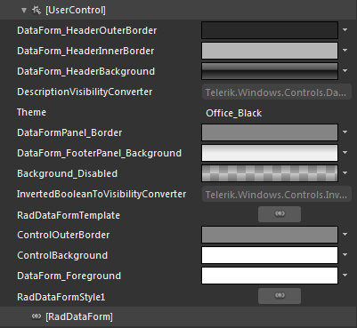
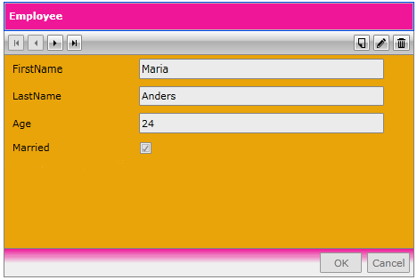

# Styling RadDataForm

>Before reading this topic, you might find useful to get familiar with the[Template Structure of the RadDataForm control]().

__RadDataForm__ exposes a Style property which allows you to apply a particular style to it and modify its appearance.

You have two options:

* To create an empty style and set it up on your own.

* To copy the default style of the control and modify it.

This topic will show you how to perform the second one. 

## Modifying the Default Style

To copy the default styles, load your project in Expression Blend and open the User Control that holds the __RadDataForm__. In the 'Objects and Timeline' pane select the __RadDataForm__ you want to style. From the menu choose  *Object -> Edit Style -> Edit a Copy *. You will be prompted for the name of the style and where to be placed.

>If you choose to define the style in Application, it would be available for the entire application. This allows you to define a style only once and then reuse it where needed.

After clicking 'OK', Expression Blend will generate the default style of the RadDataForm control in the Resources section of your User Control. The properties available for the style will be loaded in the 'Properties' pane and you will be able to modify their default values. You can also edit the generated XAML in the XAML View or in Visual Studio. If you go to the 'Resources' pane, you will see an editable list of resources generated together with the style and used by it. In this list you will find the brushes, styles and templates needed to change the visual appearance of the __RadDataForm__. Their names indicate to which part of the __RadDataForm__ appearance they are assigned.

* __DataForm_HeaderOuterBorder__-a brush that represents the outer border colour of RadDataForm’s header

* __DataForm_HeaderInnerBorder__-a brush that represents the inner border color of RadDataForm’s header

* __DataForm_HeaderBackground__-a brush that paints the background of RadDataForm’s header

* __DataFormPanel_Border__- a brush that represents the border colour around the ScrollViewer

* __DataForm_FooterPanel_Background__- a brush that paints the background of the RadDataForm’s footer

* __Background_Disabled__ - a brush that paints the background  of RadDataForm when it is disabled

* __ControlBackground__ - a brush that represents the background color of the RadDataForm.

* __ControlOuterBorder__ - a brush that represents the outer border color of the RadDataForm.

* __DataForm_Foreground__ - a brush that represents the foreground color of the RadDataForm’s Header  

Below is an example of the described resources modified:
 

And here is a snapshot of the result:

