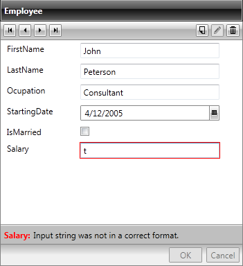
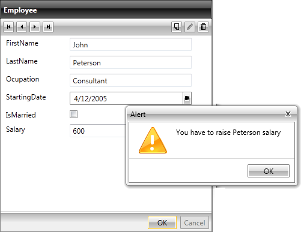

# Property level validation

RadDataForm provides data validation of the user input. Data Validation enables you to take complete control of the data entered in the fields of the data form. 

Generally, the built-in validation will be performed once the edit has been committed and the RadDataForm will be visualized as follows:

In the case above the Framework handles the validation and it fails due to type incompatibility.

However, you are free to perform your own custom logic when validating. The first approach would be to handle the ValidatingItem event of the RadDataForm. You may subscribe to it, define the validation rules you want to apply and cancel the default validation.

For example:

#### __[C#] Example 1: Handling the ValidatingItem Event__

	{{region cs-raddataform-validation_0}}
	private void DataForm1_ValidatingItem(object sender, System.ComponentModel.CancelEventArgs e)
	{
	    var employer = this.DataForm1.CurrentItem as Employee;
	    if (employer.Salary < 1000)
	    {
	      	e.Cancel = true;
	        RadWindow.Alert("You have to raise " + employer.LastName + " salary");
	    }
	}
{{endregion}}

#### __[VB.NET] Example 1: Handling the ValidatingItem Event__

	{{region vb-raddataform-validation_0}}
	Private Sub DataForm1_ValidatingItem(sender As Object, e As System.ComponentModel.CancelEventArgs)
	    Dim employer = TryCast(Me.DataForm1.CurrentItem, Employee)
	    If employer.Salary < 1000 Then
	    	e.Cancel = True
	        RadWindow.Alert("You have to raise " & Convert.ToString(employer.LastName) & " salary")
	    End If
	End Sub
{{endregion}}

In this case the RadDataForm will be displayed as the image below:

Yet another approach applicable when defining custom fields is to specify the validation properties in the binding and perform the logic inside the property setter. For example:

#### __[C#] Example 2: Perform the Validation inside the Property Setter__

	{{region cs-raddataform-validation_1}}
	public DateTime StartingDate
	{
	    get
	    {
	        return this.startingDate;
	    }
	    set
	    {
	        if (value != this.startingDate)
	        {
	            if (value > DateTime.Now)
	            {
	                throw new ValidationException("Starting date should not be earlier than 2011");
	            }
	            else
	            {
	                this.startingDate = value;
	                this.OnPropertyChanged("StartingDate");
	            }
	        }
	    }
	}
{{endregion}}

#### __[VB.NET] Example 2: Perform the Validation inside the Property Setter__

	{{region vb-raddataform-validation_1}}
	Public Property StartingDate() As DateTime
	    Get
	        Return Me.m_startingDate
	    End Get
	    Set(value As DateTime)
	        If value <> Me.StartingDate Then
	            If value > DateTime.Now Then
	                Throw New ValidationException("Starting date should not be earlier than 2011")
	            Else
	                Me.m_startingDate = value
	                Me.OnPropertyChanged("StartingDate")
	            End If
	        End If
	    End Set
	End Property
{{endregion}}

The definition of the DataFormDataField should be like follows:

#### __[XAML] Example 3: Defining the DataFormDataField__

	{{region xaml-raddataform-validation_2}}
	<telerik:DataFormDateField Label="Starting date" DataMemberBinding="{Binding StartingDate, Mode=TwoWay, ValidatesOnExceptions=True, NotifyOnValidationError=True}"/>
{{endregion}}

Once the validation is performed, the RadDataForm will be displayed as in the image below:

