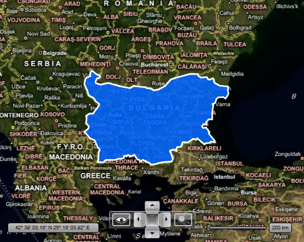

# KML Data Import

The __RadMap__ provides support for stunning map overlays through its KML-import feature. Once you have the desired set of features (place marks, images, polygons, textual descriptions, etc.) encoded in KML, you can easily import the data and visualize it through the __RadMap__ control. In this way you can easily visualize complex shapes like country's borders on the map and fill the separate shapes with different colors in order to achieve a sort of grouping.

>tip To learn more about the __KML__ you can read [here](http://code.google.com/apis/kml/documentation/).

This topic will explain the following:

* [Reading KML files with RadMap](#reading-kml-files-with-radmap)

* [Manual Shape Reading](#manual-shape-reading)

## Reading KML files with RadMap

To read your data you have to use the __MapShapeReader__ class. To learn more about its general usage read the [Shape Reader]() topic.

To pass the desired KML file you have to use the __Source__ property of the __MapShapeReader__ and pass the __Uri__ to the desired .kml file to it. This will automatically generate shapes according to the data inside the file.

#### __XAML__
{{region radmap-features-kml-data-import_0}}
	<telerik:RadMap x:Name="radMap">
	    <telerik:InformationLayer x:Name="informationLayer">
	        <telerik:InformationLayer.Reader>
	            <telerik:MapShapeReader Source="/Silverlight.Help.RadMapSamples;component/Data/bulgaria.kml" />
	        </telerik:InformationLayer.Reader>
	    </telerik:InformationLayer>
	</telerik:RadMap>
{{endregion}}

#### __C#__
{{region radmap-features-kml-data-import_1}}
	this.informationLayer.Reader = new MapShapeReader();
	this.informationLayer.Reader.Source = new Uri( "/Silverlight.Help.RadMapSamples;component/Data/bulgaria.kml", UriKind.RelativeOrAbsolute );
{{endregion}}

#### __VB.NET__
{{region radmap-features-kml-data-import_2}}
	Me.informationLayer.Reader = New MapShapeReader()
	Me.informationLayer.Reader.Source = New Uri("/Silverlight.Help.RadMapSamples;component/Data/bulgaria.kml", UriKind.RelativeOrAbsolute)
{{endregion}}

## Manual Shape Reading

The __RadMap__ allows you to manually read the file, by which you are able to get the shapes collection, without to automatically insert it into the layer. For this purpose you have to use the __KMLReader__ static class.

First of all read the Shapefile as a resource stream. Note that the file must have its __BuildAction__ set to __Resource__. After that call the static __Read()__ method of the __KMLReader__ class and pass the resource stream to it. It returns a list of __FrameworkElement__ objects, which you can directly add to the __InformationLayer__ of the __RadMap__.

#### __XAML__

{{region radmap-features-kml-data-import_3}}
	<telerik:RadMap x:Name="radMap">
	    <telerik:InformationLayer x:Name="informationLayer" />
	</telerik:RadMap>
{{endregion}}

#### __C#__
{{region radmap-features-kml-data-import_4}}
	private void LoadKMLData()
	{
	    StreamResourceInfo streamResource = Application.GetResourceStream( new Uri( "/Sample;component/Data/bulgaria.kml", UriKind.RelativeOrAbsolute ) );
	    List<FrameworkElement> elements = KmlReader.Read( streamResource.Stream );
	    foreach ( FrameworkElement element in elements )
	    {
	        this.informationLayer.Items.Add( element );
	    }
	}
{{endregion}}

#### __VB.NET__
{{region radmap-features-kml-data-import_5}}
	Private Sub LoadKMLData()
	 Dim streamResource As StreamResourceInfo = Application.GetResourceStream(New Uri("/Silverlight.Help.RadMapSamples;component/Data/bulgaria.kml", UriKind.RelativeOrAbsolute))
	 Dim elements As List(Of FrameworkElement) = KmlReader.Read(streamResource.Stream)
	 For Each element As FrameworkElement In elements
	  Me.informationLayer.Items.Add(element)
	 Next element
	End Sub
{{endregion}}   
    
Here is a snapshot of the result:

## See Also
 * [Dynamic Layer]()
 * [Navigation]()
 * [Map Shapes]()