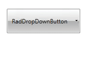
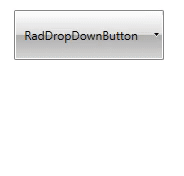
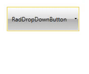

# Popup Animation

[RadDropDownButton]() and [RadSplitButton]() support popup animations. The animation is triggered when the drop down content of the button opens.

> By default the animation is not enabled.

To enable the animation you can set the __PopupAnimation__ property of the button. 

#### __[XAML] Example 1: Setting PopupAnimation__  
{{region xaml-radbuttons-features-popup-animation-0}}
	<telerik:RadDropDownButton PopupAnimation="Scroll" />
{{endregion}}

The property is an enum of type __System.Windows.Controls.Primitives.PopupAnimation__ and also determines the animation type.

* __Fade__: The popup control gradually appears, or fades out, depending on its current state (open or not).

	

* __Slide__: The popup control slides down starting from the bottom border of the button. If the screen doesn't have enough space for the popup, the sliding behaves differently according to the position of the popup.
	
	

* __Scroll__: The popup control scrolls from the lower left corner of the button. If the screen doesn't have enought space for the popup, the scrolling behaves differently according to the position of the popup.
	
	

* __None__: The popup control appears without animation. This is the default value of the property.

	

## See Also

* [Getting Started]()
* [DropDown Button]()
* [Split Button]()
